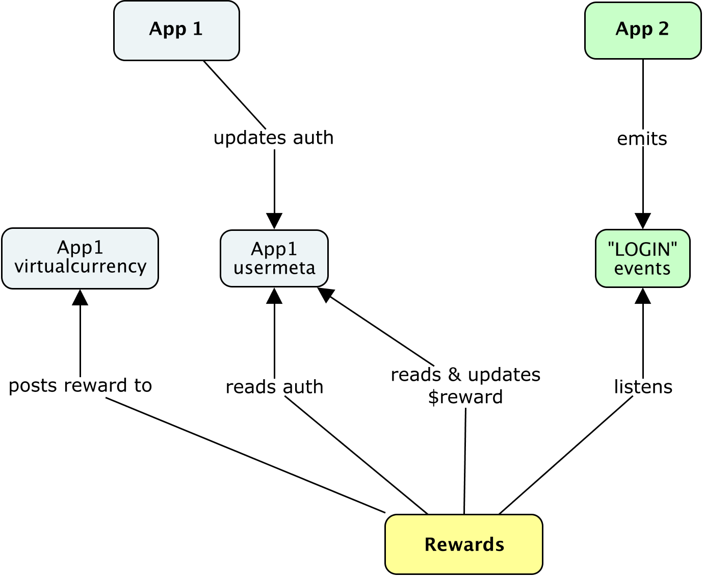

# Ganomede Rewards

Reward our beloved players.

## Configuration

  * `API_SECRET` — secret to compare to for internal access level

  * `APP_1_NAME` — Name of first app to monitor

  * `APP_2_NAME` — Name of second app to monitor

  * Reward Information (reward is sent to App 1)
    - `REWARD_APP_1_USER_LOGIN_APP_2_ID` — a string to be saved as `data.rewardId` in reward info
    - `REWARD_APP_1_USER_LOGIN_APP_2_AMOUNT` — an integer specifying amount to reward
    - `REWARD_APP_1_USER_LOGIN_APP_2_CURRENCY` — a string specifying currency to award

  * ganomede-events instance
    - `EVENTS_PORT_8000_TCP_[ADDR|PORT|PROTOCOL]` — IP|Port|Protocol to the events service
    - `EVENTS_CLIENT_ID` — non-empty string to [identify this worker](https://github.com/j3k0/ -anomede-events#new-clientclientid-options)
    - `EVENTS_CHANNEL` — non-empty string, defaults to `"users/v1"`, channel to listen for  -vents on
    - `EVENTS_PREFIX` — api prefix, defaults to `"/events/v1"`

  * virtual currency of App 1
    - `APP_1_VIRTUALCURRENCY_PORT_8000_TCP_[ADDR|PORT|PROTOCOL]` — IP|port|protocol of the virtualcurrency service for app 1
    - `APP_1_VIRTUALCURRENCY_PREFIX` — api prefix, defaults to `"/virtualcurrency/v1"`

  * usermeta of App 1
    - `APP_1_USERMETA_PORT_8000_TCP_[ADDR|PORT|PROTOCOL]` — IP|Port|Protocol to the usermeta service
    - `APP_1_USERMETA_PREFIX` — api prefix, defaults to `"/usermeta/v1"`

  * StatsD for tracking stats (if host or port are missing, no stats will be sent)
    - `STATSD_HOST`
    - `STATSD_PORT`
    - `STATSD_PREFIX` defaults to `"mailchimp.registrations."`

    This will track 4 integers:

      - `events` total number of received events
      - `failure` number of errors
      - `success` number of successes
      - `ignored` number of ignored events

  * HTTP status server
   - `HOST` non-empty string, defaults to `"0.0.0.0"`
   - `PORT` non-empty string, defaults to `8000`

## Details

This module handles a single type of reward. More might come.

### Reward 1 / 1

#### Requirement

 * In order to be incentivized to play Game-2
 * as a Game-1 user
 * I want to receive Game-1' gold coins when I login for the first time in Game-2

#### Business logic

Apps emit events to the same ganomede-events instance, with `from` set to their respective app names (see `APP_x_NAME`).

 * This worker will listen for `LOGIN` events on the `users` channel (as specified here: https://github.com/j3k0/ganomede-users/pull/25).
 * It'll check if it's from `APP_2_NAME`.
 * If it is, it loads from `APP_2_USERMETA` the `"$reward$" + REWARD_APP_1_USER_LOGIN_APP_2_ID` internal key.
    * If it's truish, do nothing else with this event.
 * Then load app-1's "auth" usermeta key.
  * If it is falsy, do nothing else with this event.
 * Then save current date in app-2's usermeta `"$reward$" + REWARD_APP_1_USER_LOGIN_APP_2_ID` internal key.
 * Then POST a reward to `APP_2_VIRTUALCURRENCY` using the internal [reward call](https://github.com/j3k0/ganomede-virtualcurrency#rewards-virtualcurrencyv1rewards) with
    * "from": "rewards/v1"
    * "currency": `REWARD_APP_1_USER_LOGIN_APP_2_CURRENCY`
    * "ammount": `REWARD_APP_1_USER_LOGIN_APP_2_AMOUNT`
    * "data": { rewardId: `REWARD_APP_1_USER_LOGIN_APP_2_ID` }

## Rest API

For monitoring, include /about and /ping calls on port 8000.

Just start from JS boilerplate.
